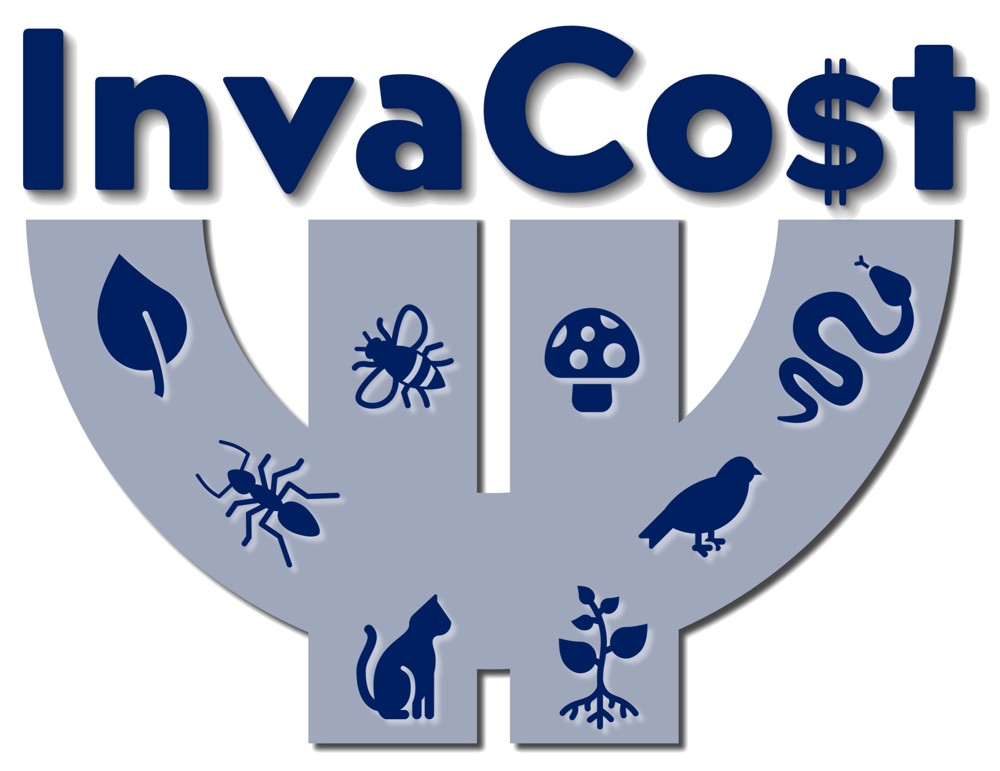
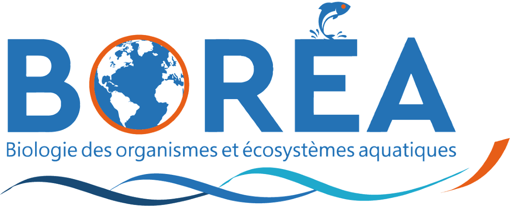

# <em>InvaCost</em> Version Trends

Temporal trends in number of database entries, number of species reported, and annual costs in different versions of the <em>InvaCost</em> database (<a href="http://invacost.fr">invacost.fr</a>) — see also the <a href="https://github.com/InvaCost">InvaCost organisation</a> page on Github.

 
Prof <a href="https://globalecologyflinders.com/people/#DIRECTOR">Corey J. A. Bradshaw</a>  
<a href="http://globalecologyflinders.com" target="_blank">Global Ecology</a> | <em><a href="https://globalecologyflinders.com/partuyarta-ngadluku-wardli-kuu/" target="_blank">Partuyarta Ngadluku Wardli Kuu</a></em>, <a href="http://flinders.edu.au" target="_blank">Flinders University</a>, Adelaide, Australia  
February 2023  
<a href=mailto:corey.bradshaw@flinders.edu.au>e-mail</a>  
 
contributors: <a href="https://www.jcu.cz/en/university/staff/person?identita=Soto_Almena_Ismael_110771">Ismael Soto</a>, <a href="https://farewe.github.io/markdown-cv/">Boris Leroy</a>, <a href="https://scholar.google.com/citations?user=fwHUGm0AAAAJ&hl=de">Phillip Haubrock</a>
 
 

<strong>Accompanies paper</strong>:

<a href="https://www.linkedin.com/in/danish-ali-ahmed-655934192/">Ahmed DA</a>, <a href="https://scholar.google.com/citations?user=fwHUGm0AAAAJ&hl=de">Haubrock PJ</a>, <a href="https://pure.qub.ac.uk/en/persons/ross-cuthbert-2">Cuthbert RN</a>, <a href="https://azimpremjiuniversity.edu.in/people/alok-bang">Bang A</a>, <a href="https://www.jcu.cz/en/university/staff/person?identita=Soto_Almena_Ismael_110771">Soto I</a>, <a href="https://www.researchgate.net/profile/Paride-Balzani">Balzani P</a>, <a href="https://scholar.google.com/citations?user=p_JjJNMAAAAJ&hl=en">Tarkan AS</a>, <a href="https://www.escavador.com/sobre/8196034/rafael-lacerda-macedo">Macêdo RL</a>, <a href="https://www.laiscarneiro.com/">Carneiro L</a>, <a href="https://scholar.google.co.uk/citations?user=9HZ_6r8AAAAJ&hl=en">Bodey TW</a>, <a href="https://scholar.google.es/citations?user=JSCqMF4AAAAJ&hl=en">Oficialdegui FJ</a>, <a href="https://scholar.google.com/citations?user=hVdcCFgAAAAJ&hl=en">Courtois P</a>, <a href="https://portal.findresearcher.sdu.dk/en/persons/mkour">Kourantidou M</a>, <a href="https://scholar.google.com/citations?user=dH_qGsMAAAAJ&hl=es">Angulo E</a>, <a href="https://loop.frontiersin.org/people/455457/overview">Heringer G</a>, <a href="https://sites.google.com/view/david-renault/home">Renault D</a>, <a href="https://scholar.google.com/citations?user=59VAYs4AAAAJ&hl=en">Turbelin AJ</a>, <a href="https://ejhudgins.com/">Hudgins EJ</a>, <a href="https://scholar.google.com/citations?user=8FMqs4kAAAAJ&hl=en">Liu C</a>, <a href="https://www.researchgate.net/profile/Showkat-Gojery">Gojery SA</a>, <a href="https://scholar.google.com/citations?user=ERFm7hAAAAAJ&hl=en>Arbieu U</a>, <a href="https://scholar.google.com/citations?user=Nyeg3eIAAAAJ&hl=fr">Diagne C</a>, <a href="https://farewe.github.io/markdown-cv/">Leroy B</a>, <a href="https://scholar.google.com/citations?user=fENP_aoAAAAJ&hl=en">Briski E</a>, <a href="https://globalecologyflinders.com/people/#DIRECTOR">Bradshaw CJA</a>, <a href="https://www.ese.universite-paris-saclay.fr/en/team-members/franck-courchamp/">Courchamp F</a>. In review. Recent advances in availability and synthesis of the economic costs of biological invasions. 

## Abstract
The invasion of alien species is a global challenge that has received insufficient mitigation. A growing availability of cost syntheses have recently provided policy and decision makers with reliable and up-to-date information on the economic impacts of invasive alien species, aiming to motivate effective management. The resultant <em>InvaCost</em> database is now publicly and freely accessible, embedded in the open-source <code>invacost</code> R package, and enables rapid extraction of monetary cost information globally. By providing a centralised repository of cost information accompanied by 65 descriptors, the database has facilitated knowledge sharing, developed a more integrated and multidisciplinary network of researchers, and forged multidisciplinary collaborations among diverse organisations and stakeholders. Over 50 scientific publications so far have used the database and provided detailed assessments of invasion costs across geographic, taxonomic, and spatio-temporal scales. These studies have been instrumental in guiding policy and legislative decisions, while attracting public and media attention. We provide an overview of the improved availability, reliability, and defragmentation of monetary costs achieved through the InvaCost database. We describe how this focus on costs has evolved and enhanced invasion science as a discipline, and detail planned directions for future development.  

## Scripts
- <code>InvaCostTrends.R</code>

## Data
- This directory contains several .csv files listing supplementary information for the article cited above.

## Required R packages
- <code><a href="https://github.com/InvaCost/invacost">invacost</a></code>
- <code>dplyr</code>
- <code>tidyr</code>
- <code>rms</code>

